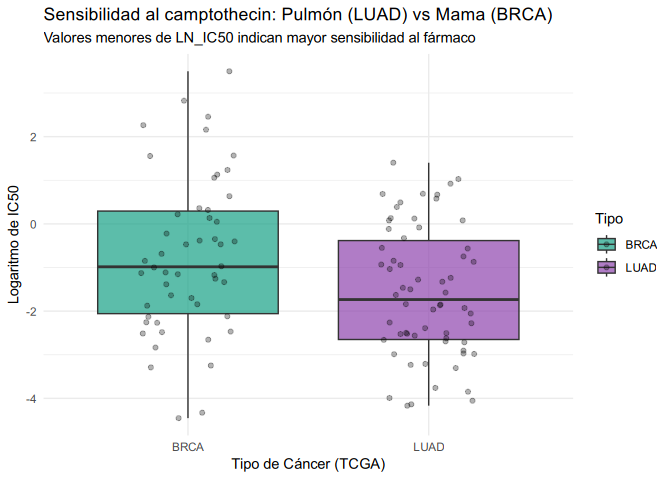

 Genomica de la
sensibilidad a los medicamentos en el cancer (GDSC)


================
Ainhoa Romero, Andrea Ponce y Maria Perez
2025-12-17

<style>
  h1.title {
    color: #2980B9;
    font-family: Verdana, sans-serif;
    font-weight: normal;
    text-align: center;
    font-size: 32px;
  }
  h4.author {
    color: #800020;
    text-align: center;
  }
  body {
    text-align: justify;
  }
</style>
<!--Cargar las libreias que vamos a utilizar, queremos que el codigo se ejecute, pero no aparezca en el documento final, tambien excluimos los avisos y mensajes-->
<!--Para generar titulos, subtitulos etc se usa # el numero de # determina el estilo y el formato del texto-->

# Introduccion

## Trabajo seleccionado

Vamos a trabajar con los datos de ——.En nuestra base de datos hemos
encontrado un total de 5 archivos:  

1.**“Compounds-annotation.csv”**es un diccionario de fármacos, relaciona
el nombre del fármaco con su objetivo biológico y la vía de señalización
a la que afecta.  
2.**“cell_lines_details.xlsx”** es un archivo que contiene las
características biológicas de las células usadas en el experimento  
3.**“cell_lines_details.xlsx-decode.csv”** es un leyenda para entender
las abreviaturas  
4.**“GDSC2-dataset.csv”** está es la fuente original del archivo que
hemos utilizado  
5.<span style="color: red;">“GDSC_dataset.csv”</span> este es el archivo
que hemos utilizado. Combina la información de la línea celular, el tipo
de cáncer, el fármaco y la repuestos al fármaco.  

Vamos a comparar la respuesta del fármaco *Camptothecin*, un inhibidor
de topoisimerasa, entre **celulas de cancer de pulmon (LUAD) y cáncer de
mama (BRCA). **


## Los datos

<!-- Leer los datos desde el fichero que esta en la misma carpeta que Rmarkdown. Si el fichero est en otra carpeta actualizar la localizacion del archivo-->
<!-- El codigo en R en linea-->

Los datos tiene 112 filas y 5columnas.

<!-- Links a pginas/archivos externos [](direccinLink)-->

Los datos de este proyecto fueron descaragdos desde \[kaggle GDSC\]
(<https://www.kaggle.com/datasets/samiraalipour/genomics-of-drug-sensitivity-in-cancer-gdsc/data>)

<!-- Primera vsita de los datos -->

|  X  | CELL_LINE_NAME | TCGA_DESC |  DRUG_NAME   |  LN_IC50  |
|:---:|:--------------:|:---------:|:------------:|:---------:|
|  1  |     Calu-3     |   LUAD    | Camptothecin | -1.629546 |
|  2  |   NCI-H1437    |   LUAD    | Camptothecin | -1.839524 |
|  3  |   NCI-H1623    |   LUAD    | Camptothecin | -4.135944 |
|  4  |   NCI-H1648    |   LUAD    | Camptothecin | -1.962265 |
|  5  |   NCI-H1650    |   LUAD    | Camptothecin | 0.133024  |
|  6  |   NCI-H1693    |   LUAD    | Camptothecin | 0.121965  |
|  7  |   NCI-H1838    |   LUAD    | Camptothecin | 0.690985  |
|  8  |   NCI-H2085    |   LUAD    | Camptothecin | 0.578666  |

Tabla 1: Ocho primeras filas de los datos filtrados

Cargamos el conjunto de datos principal y filtramos la información
necesaria para el análisis.

Para el análisis, hemos creado un subconjunto de datos (datos_analisis)
seleccionando únicamente las variables que nos interesan para nuestra
hipótesis: -La medida de sensibilidad del fármaco (LN_IC50), es una
variable numérica (continua) dependiente, porque su valor depende del
tipo de células que estemos mirando. Es el efecto o el resultado que
medimos. - El tipo histológico de cáncer (TCGA_DESC) es una variable
categórica e independiente, porque es la categoria que define los
grupos. No cambia, es una caracteristica fija de las células (o es de
pulmón o es de mama) es la supuesta causa de que la sensibilidad
cambie. - Se ha incluido también el identificador de la línea celular
(CELL_LINE_NAME) y el nombre del fármaco(DRUG NAME) para asegurar la
integridad de los datos y el correcto filtrado de la muestra.

``` default

# Limpieza y filtrado con dplyr
datos_analisis <- GDSC_DATASET %>% # Le asignamos un nuevo nombre a nuestra base de datos filtrada
  select(CELL_LINE_NAME, TCGA_DESC, DRUG_NAME, LN_IC50) %>% # Filtra las variables de interes
  filter(DRUG_NAME == "Camptothecin") %>% # Filtramos el farmaco que vamos a estudiar
  filter(TCGA_DESC %in% c("LUAD", "BRCA")) # Filtramos por las enfermedades que vamos a estudiar
  
write.csv(datos_analisis, "GDSC_DATASET_filtrado.csv")

# Verificamos cuántos datos tenemos de cada grupo
table(datos_analisis$TCGA_DESC)
```

Vamos a analizar cómo la variable independiente (TCGA_DESC) influye
sobre la variable dependiente numérica (LN_IC50). Necesitamos filtrar la
variable DRUG NAME, porque solo nos interesa el fármaco Camptothecin y
también la variable TCGA_DESC según los tipos de cáncer que vamos a
estudiar: LUAD (cáncer de pulmón) y BRCA (cáncer de mama)

# Visualización de Datos

En este boxplot se compara la sensibilidad al fármaco Camptothecin entre
los dos tipos de cáncer (BRCA y LUAD). En eje X se muestran los 2 tipos
de cáncer y el eje y es LN IC50

<!-- -->

**INTERPRETACIÓN DEL GRÁFICO:**

Los valores más bajos de LN\_ IC50 tienen mayor sensibilidad al fármaco
y los más altos más resistencia. Podemos observar que el cáncer de
pulmón (LUAD) tiene la mediana más baja que el de mama (BRCA) y BCRA
tiene valores más altos, es decir que LUAD es más sensible a la
Camptotecina. Ambos grupos muestran bastante variabilidad, como se
observa por la dispersión de los puntos individuales alrededor de las
cajas de las cajas del boxplot. En ambos tipos de cáncer se observan
valores. No obstante, en el grupo BRCA aparecen valores más altos de
LN\_ IC50, lo que indica que algunos casos presentan una clara
resistencia al fármaco en comparación con LUAD.

# Hipotesis

El objetivo es determinar si existe una diferencia significativa en la
sensibilidad al farmaco **Camptothecin** entre las lineas celulares de
**Adenocarcinoma de Pulmon (LUAD)** y **Carcinoma Invasivo de Mama
(BRCA)**

H0: No existe diferencia en la media de sensibilidad (LN_IC50) al
Camptothecin entre celulas de pulmon (LUAD) y celulas de mama (BRCA)  
H1: Existe una diferencia significativa en la sensibilidad media entre
ambos tipos de cancer.

# Materiales y metodos

Para llevar a cabo el analisis usamos R \[@R-base\] con las librerias
dplyr \[@R-dplyr\] y ggplot \[@R-ggplot2; @ggplot22016\]. Para la
creacion de este informe hemos utilizado el paquete knitr \[@R-knitr;
@knitr2015; @knitr2014\] y pandoc.

# Resultados

## Test Estadístico

Finalmente, ejecutamos el código para validar la hipótesis. Usaremos un
**T-test para muestras independientes**.

Esta eleccion se fundamenta en el diseo experimental, que busca comparar
las medias de una variable cuantitativa continua (la sensibilidad al
farmaco, LN_IC50) entre dos grupos categoricos y excluyentes (tipos de
cancer LUAD y BRCA). Se asume que las observaciones entre ambos grupos
son independientes entre si, ya que provienen de lineas celulares
biologicamente distintas.

    ## 
    ##  Welch Two Sample t-test
    ## 
    ## data:  LN_IC50 by TCGA_DESC
    ## t = 2.607, df = 94.942, p-value = 0.01061
    ## alternative hypothesis: true difference in means between group BRCA and group LUAD is not equal to 0
    ## 95 percent confidence interval:
    ##  0.1968775 1.4541550
    ## sample estimates:
    ## mean in group BRCA mean in group LUAD 
    ##         -0.7394637         -1.5649799

# Conclusion

Dado que el p_valor es 0.01 y y el nivel de significacion de 0.05,
consideramos que estadisticamente, la respuesta al farmaco Camptothecin
en cancer de pulmon y cancer de mama es diferente segun los datos
observados.

# Informacion de la sesion y referencias

    ## R version 4.3.3 (2024-02-29)
    ## Platform: x86_64-pc-linux-gnu (64-bit)
    ## 
    ## Matrix products: default
    ## BLAS:   /usr/local/lib64/R.4.3.3/lib/libRblas.so 
    ## LAPACK: /usr/local/lib64/liblapack.so.3.10.1
    ## 
    ## locale:
    ##  [1] LC_CTYPE=es_ES.UTF-8       LC_NUMERIC=C              
    ##  [3] LC_TIME=es_ES.UTF-8        LC_COLLATE=es_ES.UTF-8    
    ##  [5] LC_MONETARY=es_ES.UTF-8    LC_MESSAGES=es_ES.UTF-8   
    ##  [7] LC_PAPER=es_ES.UTF-8       LC_NAME=C                 
    ##  [9] LC_ADDRESS=C               LC_TELEPHONE=C            
    ## [11] LC_MEASUREMENT=es_ES.UTF-8 LC_IDENTIFICATION=C       
    ## 
    ## time zone: NA
    ## tzcode source: system (glibc)
    ## 
    ## attached base packages:
    ## [1] datasets  utils     grDevices graphics  stats     methods   base     
    ## 
    ## other attached packages:
    ## [1] readxl_1.4.3  ggplot2_3.5.1 dplyr_1.1.4  
    ## 
    ## loaded via a namespace (and not attached):
    ##  [1] vctrs_0.6.5       cli_3.6.3         knitr_1.49        rlang_1.1.4      
    ##  [5] xfun_0.49         generics_0.1.3    labeling_0.4.3    glue_1.8.0       
    ##  [9] colorspace_2.1-1  htmltools_0.5.8.1 scales_1.3.0      fansi_1.0.6      
    ## [13] rmarkdown_2.29    cellranger_1.1.0  grid_4.3.3        munsell_0.5.1    
    ## [17] evaluate_1.0.1    tibble_3.2.1      fastmap_1.2.0     yaml_2.3.10      
    ## [21] lifecycle_1.0.4   compiler_4.3.3    pkgconfig_2.0.3   rstudioapi_0.17.1
    ## [25] farver_2.1.2      digest_0.6.37     R6_2.5.1          tidyselect_1.2.1 
    ## [29] utf8_1.2.4        pillar_1.9.0      magrittr_2.0.3    withr_3.0.2      
    ## [33] tools_4.3.3       gtable_0.3.6
